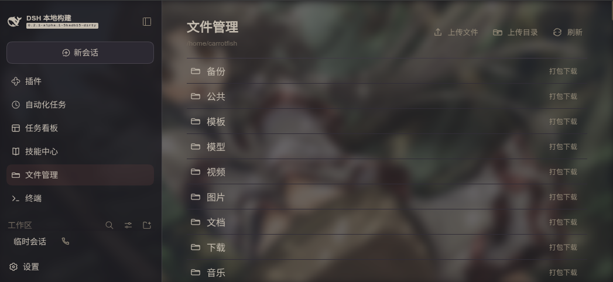
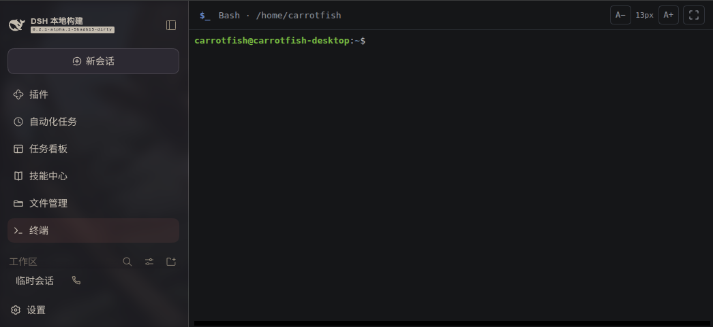

# DSH 文件管理与终端

为 DSH Web 配置添加“文件管理”和“终端”面板。若安装了 `dsh-better-sidebar`，两个面板也会注册为侧栏标签；侧栏和主面板共享文件浏览状态与 Bash 终端，不会为同一个视图重复启动进程。

## 界面预览

### 文件管理



### Bash 终端



## 安装

从本地项目目录安装：

```sh
dsh plugin --profile web add .
```

也可以从 GitHub 安装：

```sh
dsh plugin --profile web add github:CarrotFish/dsh-file-and-terminal
```

安装后启动或重启 Web profile：

```sh
dsh web
```

## 文件管理

文件管理器从配置的 `root` 目录开始浏览，默认值为用户主目录 `~`。支持：

- 浏览目录、进入子目录和返回上一级。
- 上传多个文件，或上传整个目录并保留目录结构；不会覆盖已有文件。
- 下载单个文件，或将目录打包为 ZIP 下载。
- 仅跟随目标仍位于配置根目录内的符号链接。

每次目录列表最多显示 `maxEntries` 项。单文件下载大小受 `maxDownloadBytes` 限制；目录 ZIP 按未压缩总大小计算。上传总大小受 `maxUploadBytes` 限制。上传目录最多包含 10,000 个文件或目录项。

## 终端

终端面板提供宿主上的交互式 Bash PTY，并以 xterm.js 显示终端内容。它独立于对话和 Session；切换面板时会保留终端会话和屏幕内容。关闭 Web 页面或卸载插件时，终端进程会被终止。终端从配置的 `root` 目录启动。

## 配置

在 profile 的 `cordis.patch.yml` 中配置插件：

```yaml
- insert:
    - id: file-and-terminal
      name: dsh-plugin-file-and-terminal
      config:
        root: "~"
        maxEntries: 1000
        maxDownloadBytes: 67108864
        maxUploadBytes: 67108864
```

`maxDownloadBytes` 和 `maxUploadBytes` 默认均为 64 MiB。插件还提供 `terminalBufferBytes`、`terminalGraceMs` 和 `maxTerminals` 配置项，用于限制终端输出缓冲区、进程宽限时间和同时打开的终端数。

## 安全提示

此插件可访问宿主文件系统中配置根目录内的内容，并提供宿主 Bash 终端。只应在可信的 DSH Web 部署中启用，并妥善设置 `root` 与上传、下载大小限制。
